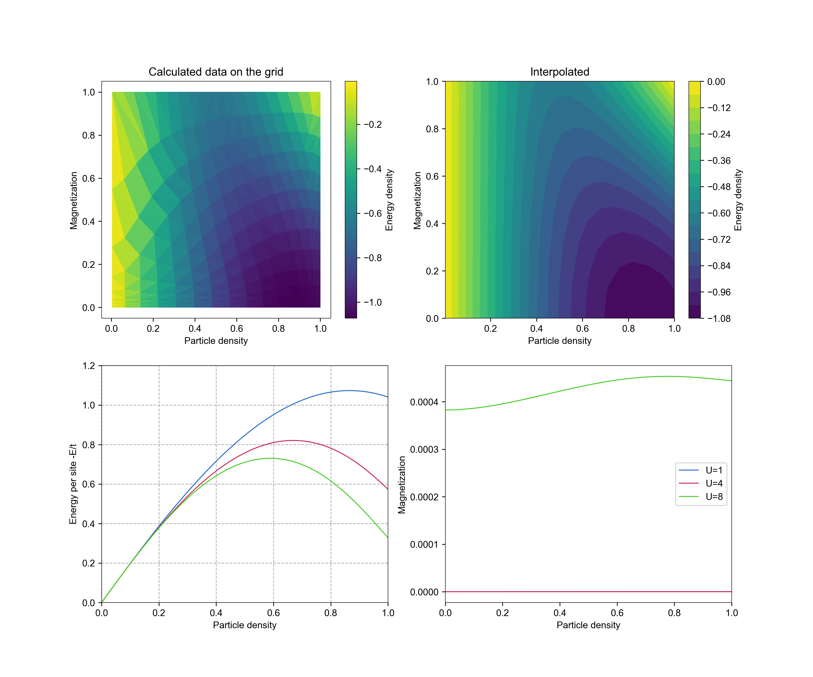

Hubbard-Bethe
=============

Demonstrates how to find the ground state of the Hubbard model with infinite boundary conditions using Bethe ansatz.
This python implementation is based on the [original paper by Lieb and Wu (2003)](https://arxiv.org/abs/cond-mat/0207529).
The bottom left plot resembles that of [Knizia and Chan (2012)](https://arxiv.org/abs/1204.5783), Fig. 1(a).

